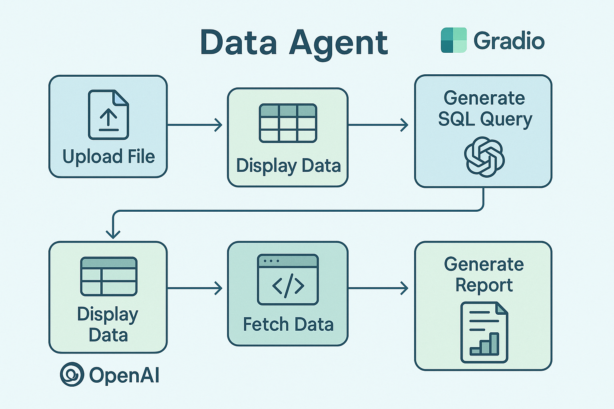

## Data Agent

### Project Overview
- This project leverages large language models (LLMs) for data analysis, utilizing prompt engineering to generate SQL queries that retrieve data. The system helps you analyze the data, generate charts, and answer any relevant questions you propose.

### How To Use：

1. ```bash 
   pip install -r requirements.txt
    ```
2. ```bash 
   python main.py --openai_key your_key    
   ```
- **Upload data**：Upload one or more CSV files for analysis.

- **Explore Data Schema**: After uploading, the system generates a schema description to help you understand your data structure.
- **Ask Questions**: Type your query in natural language about the data.

- **View Reports and Visualizations**:  The system will generate SQL queries based on your description, fetch the data, debug and regenerate SQL queries as needed, and create visualizations along with a detailed report.
 
 ### Workflow
The project follows a structured data analysis workflow:

  1. **Data Upload**: CSV files are uploaded for processing.

  2. **Data Schema Generation**: The system generates a description of your data schema.

  3. **Query Description**: Describe the data you want to analyze in natural language.
  
  4. **SQL Query Generation**: The system generates SQL queries based on the description.
  
  5. **SQL Execution**: Queries are executed on the uploaded data to fetch the necessary information.
  
  6. **Report and Visualization**: The system generates detailed reports and visualizations based on the retrieved data.
  
  7. **Error Handling**: If SQL errors are encountered, the system provides suggestions for corrections.
  
  8. **Final Report**: Receive a comprehensive report, including SQL queries, retrieved data, and visualizations.

  ### Dependencies

- openai: OpenAI Python SDK for interfacing with GPT
- pandas: For data manipulation and analysis.
- pandasql: For running SQL queries on DataFrame objects.
- gradio: For creating the user interface.


### Suggestions and Issues

- We hope this project proves helpful! If you have any feedback, ideas, or questions, feel free to contact me through the issues section. Thank you!

